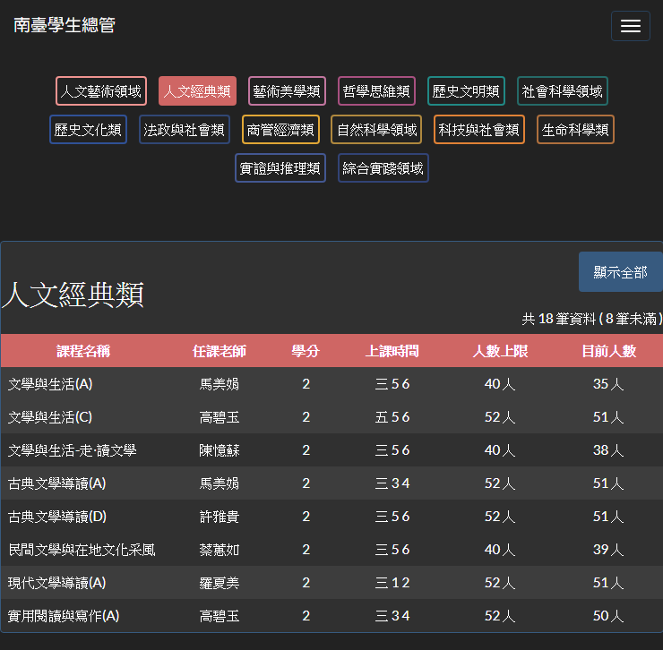
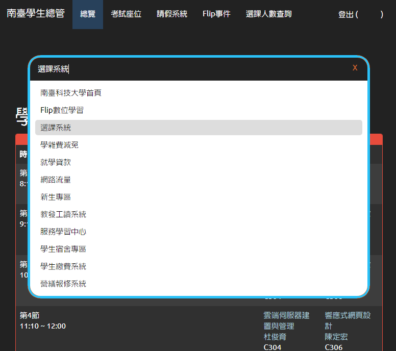
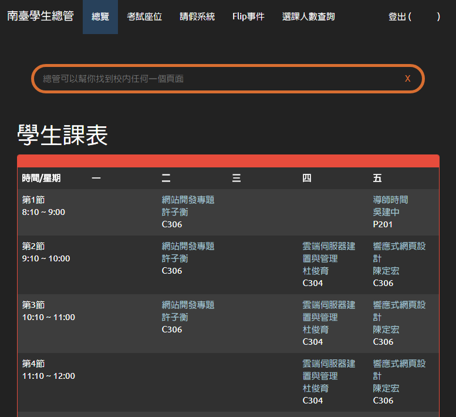
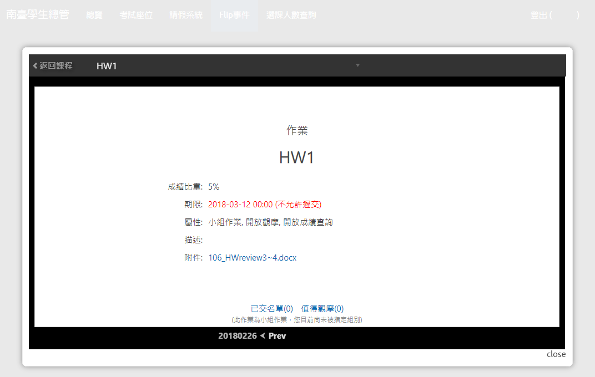

# STUST-Explorer

這是什麼？
---------
南臺學生總管是由三位大四資工系老屁股共同完成的學校整合服務，以 Node JS + Express 進行開發，並且依照學生使用經驗，整合學生常用的學校服務，也簡化繁瑣的操作流程，並且使用 Bootstrap 樣板，提供對於學生更友善的操作環境，同時支援手機與電腦上的操作。  
  
你可以透過以下連結使用南台學生總管  
https://stust.mks.tw/

功能
---------

* 課表總覽整合 Flip 課程連結
* 快捷校內網頁搜尋功能
* 考試座位快速查詢
* 請假系統整合
* Flip 事件總覽
* 通識選課人數查詢

部分更新
---------
2018-08-24  
修正 登入後，異常登出問題。  
  
2018-06-28  
修正 預防 Heroku 進入休眠狀態  
修改 Cookie & Session 方法(提升安全性)  
  
2018-06-25  
修正 考試座位功能: 透過記錄帳號、密碼再次登入會顯示「查無考試時間」問題已修復  
  
2018-04-14  
修正 應應學校選課系統改為 HTTPS 功能失效問題  
  
2018-03-08  
修正 部分「魔術數字」變數、參數  
修正 選修日校生 選修夜校課程自動隱藏問題  
修正 老師姓名非三字時的顯示問題  
  
2018-03-07  
修正 Flip事件 無訊息時的 Bug  
修改 部分 CSS 樣式  
  
2018-03-03  
新增 課表上事件提醒圖示  
新增 Flip 事件中的最新文件  
更新 Flip 事件的自適化  
更新 優化服務效能  
修正部分 Bug  

其他
---------
本專案由 ADR isuMaster-NodeJS 啟發  
https://github.com/aaaddress1/isuMaster-NodeJS