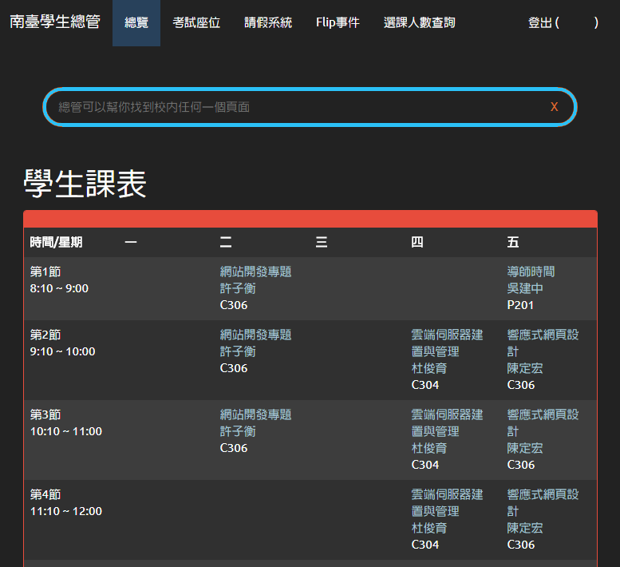

# STUST-Explorer

這是什麼？
---------
南臺學生總管是由三位大四資工系老屁股共同完成的學校整合服務，以 Node JS + Express 進行開發，並且依照學生使用經驗，整合學生常用的學校服務，也簡化繁瑣的操作流程，並且使用 Bootstrap 樣板，提供對於學生更友善的操作環境，同時支援手機與電腦上的操作。

功能
---------

* 課表總覽整合 Flip 課程連結
* 快捷校內網頁搜尋功能
* 考試座位快速查詢
* 請假系統整合
* Flip 事件總覽
* 通識選課人數查詢

其他
---------
本專案由 ADR isuMaster-NodeJS 啟發
https://github.com/aaaddress1/isuMaster-NodeJS